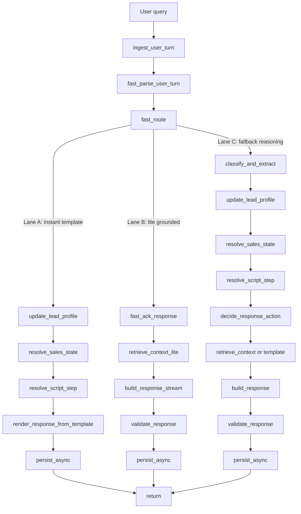

Mình đề xuất flow mới theo mục tiêu duy nhất: **giảm thời gian user phải chờ câu đầu tiên**.

Flow hiện tại của bạn là một pipeline LangGraph khá “đủ bài”: ingest → classify/extract → update profile → resolve state → resolve step/action → template hoặc retrieve → build → validate → persist .
State cũng đang mang khá nhiều trường cho intent, slot, retrieval, response .
Điểm nghẽn là nhánh grounded thường phải đi qua `classify_and_extract` (LLM) , rồi `retrieve_context` (RAG) , rồi `build_response` (LLM) .

Nên flow mới nên đổi từ kiểu:

**full reasoning trước, trả lời sau**

sang:

**phản hồi nhanh trước, làm giàu sau**

---

## Flow mới tối ưu latency

### Phase 0: Preload cực nhẹ

Ngay khi nhận query:

* load `lead_profile`, `session_context`, `chat_history` gần nhất
* normalize text
* chạy regex/rule parser cực nhanh

Mục tiêu:

* không gọi LLM ở bước đầu
* lấy ngay các tín hiệu dễ đoán:

  * family size
  * children count
  * purpose
  * location
  * project name
  * so sánh / objection / buy signal / greeting

Bạn đã có state fields rất phù hợp cho cách này như `detected_intent`, `extracted_slots`, `current_sales_state`, `missing_slots`, `resolved_project_name` .

---

### Phase 1: Fast Router

Tạo một node mới trước graph chính, ví dụ:

`fast_intake_router`

Node này không dùng LLM, chỉ rule-based.

Nó sẽ chia query vào 3 lane:

#### Lane A — Instant template

Dùng khi:

* greeting
* user chỉ trả lời 1 slot ngắn như “4 người”, “2 con nhỏ”, “mua để ở”, “quanh Tây Hồ”
* đang ở `need_discovery` và chỉ cần hỏi tiếp slot còn thiếu

Ở lane này:

* update slot bằng rule
* resolve state/step bằng rule
* render template ngay
* bỏ qua LLM
* bỏ qua RAG

Đây là lane nhanh nhất.

#### Lane B — Lite grounded

Dùng khi:

* hỏi project cụ thể
* hỏi pháp lý, vị trí, tiện ích, giá
* so sánh rõ ràng
* objection phổ biến

Ở lane này:

* trả một câu mở đầu ngay
* sau đó mới retrieve và build response chi tiết

Ví dụ:

> “Để em kiểm tra đúng dữ liệu của dự án này và trả lời ngắn gọn, chính xác cho Anh/Chị nhé.”

Câu này có thể trả gần như tức thì.

#### Lane C — Fallback reasoning

Dùng khi:

* intent mơ hồ
* parse thất bại
* user hỏi dài, lẫn nhiều ý
* thiếu tự tin để route

Chỉ lane này mới gọi `classify_and_extract` LLM đầy đủ .

---

## Flow đề xuất chi tiết

### 1. `ingest_user_turn`

Giữ nguyên.

### 2. `fast_parse_user_turn` mới

Làm bằng rule/regex:

* parse số người
* parse số con
* parse “để ở / đầu tư / kinh doanh”
* parse location
* parse project name kiểu `Noble...`
* parse buy-signal keyword
* parse objection keyword
* parse comparison keyword

Output:

* `extracted_slots`
* `detected_intent_candidate`
* `resolved_project_name`
* `fast_path_confidence`

### 3. `fast_route`

Nếu confidence cao thì không vào LLM classifier.

Quy tắc:

* chỉ có slot update đơn giản → lane A
* project QA/comparison rõ → lane B
* còn lại → lane C

### 4. Lane A — trả lời ngay

Flow:

`fast_parse_user_turn -> update_lead_profile -> resolve_sales_state -> resolve_script_step -> render_response_from_template -> persist_async`

Ở lane này bỏ:

* `classify_and_extract`
* `retrieve_context`
* `build_response`

Hiện tại repo của bạn đã có template responses và scripted steps rất phù hợp cho lane này  .

### 5. Lane B — trả lời 2 pha

Flow:

`fast_parse_user_turn -> fast_ack_response -> retrieve_context_lite -> build_response_stream -> validate -> persist`

Điểm khác quan trọng:

* `fast_ack_response` trả câu đầu tiên ngay
* `retrieve_context_lite` dùng query ngắn hơn, ít context hơn
* `build_response_stream` stream token ra luôn

Ví dụ:
user hỏi:

> “pháp lý Noble Crystal Tây Hồ thế nào?”

Agent:

1. trả ngay:
   “Để em kiểm tra đúng phần pháp lý của dự án này và trả lời ngắn gọn cho Anh/Chị nhé.”
2. rồi stream câu trả lời grounded

### 6. Lane C — reasoning đầy đủ

Mới dùng:

`classify_and_extract -> update_lead_profile -> resolve_sales_state -> resolve_script_step -> decide_response_action -> ...`

Tức là flow cũ vẫn giữ, nhưng chỉ cho các case khó.

---

# Kiến trúc graph mới

Có thể hình dung như này:

---

# Những thay đổi cụ thể mình khuyên làm

## 1. Thêm `fast_parse_user_turn`

Đây là node quan trọng nhất.

Nó nên parse được ít nhất:

* `family_member_count`
* `children_count`
* `purpose`
* `location_preference`
* `resolved_project_name`
* `comparison`
* `buy_signal`
* `objection_type`

Càng parse được nhiều bằng rule, càng ít phải gọi LLM.

## 2. Bỏ `classify_and_extract` khỏi default path

Hiện tại nó đang là bước bắt buộc sớm trong graph .
Đây là lý do nhiều turn đơn giản vẫn phải chờ LLM.

Nên đổi:

* chỉ gọi node này khi `fast_route` thấy mơ hồ

## 3. Tách `retrieve_context` thành 2 loại

Hiện `retrieve_context` build query khá dày theo state template .

Nên tách:

* `retrieve_context_lite`

  * cho project QA đơn giản
  * top_k thấp hơn
  * history ngắn hơn
  * query ngắn hơn

* `retrieve_context_full`

  * cho matching/comparison/objection phức tạp

## 4. Thêm `fast_ack_response`

Node này chỉ có nhiệm vụ tạo câu xác nhận 1 câu, không cần LLM.

Ví dụ:

* project_qa → “Để em kiểm tra đúng dữ liệu dự án này và trả lời ngắn gọn cho Anh/Chị nhé.”
* comparison → “Em lọc nhanh 2 phương án để so sánh đúng trọng tâm cho Anh/Chị nhé.”
* objection → “Em hiểu băn khoăn của Anh/Chị, để em đối chiếu lại thông tin phù hợp nhất nhé.”

## 5. Stream ở `build_response`

Đây là điểm quan trọng về UX.
Dù tổng thời gian không giảm cực mạnh, user sẽ thấy phản hồi bắt đầu ngay.

## 6. `persist_turn` đẩy ra ngoài critical path

Hiện đang persist history, lead profile, session context, snapshot trong flow chính .
Nên đổi sang fire-and-forget hoặc background task sau khi đã trả câu trả lời đầu tiên.

---

# Thứ tự rollout thực tế

## Bước 1

Thêm `fast_parse_user_turn` + `fast_route`

## Bước 2

Cho `need_discovery` và greeting đi thẳng template path, không qua LLM

## Bước 3

Thêm `fast_ack_response` cho project_qa/comparison

## Bước 4

Chỉ gọi `classify_and_extract` khi parse confidence thấp

## Bước 5

Tách `retrieve_context_lite` và giảm `top_k`

## Bước 6

Streaming ở `build_response`

---

# Tác động kỳ vọng

Với flow mới:

### Các turn đơn giản

Ví dụ:

* “4 người”
* “2 con nhỏ”
* “mua để ở”
* “quanh Tây Hồ”

Có thể đi từ vài giây xuống gần như tức thì, vì không còn phải đi qua `classify_and_extract` LLM nữa .

### Các turn hỏi dự án

Ví dụ:

* “pháp lý Noble X thế nào?”

Vẫn cần retrieval + generation, nhưng user nhận được câu đầu tiên ngay nhờ `fast_ack_response`, rồi phần trả lời chi tiết đến sau.

### Các turn khó

Flow cũ vẫn giữ làm fallback, nên chất lượng không bị tụt mạnh.

---

# Kết luận

Flow mới nên là:

**rule-first, fast-route, instant reply, selective reasoning**

Chứ không phải:

**LLM-first cho mọi turn**

Nếu nói ngắn gọn thành một câu:

**Hãy biến `classify_and_extract` từ bước bắt buộc thành bước fallback.**
Đó là thay đổi lớn nhất để tối ưu latency cho agent sale hiện tại.

Mình có thể viết tiếp cho bạn một bản rất cụ thể gồm:

* sơ đồ Mermaid mới
* danh sách node mới/cũ
* pseudo-code cho `fast_parse_user_turn` và `fast_route` để gắn thẳng vào LangGraph.
