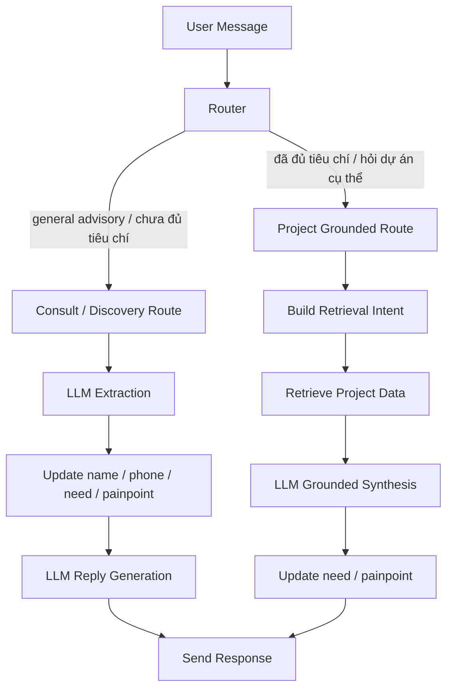
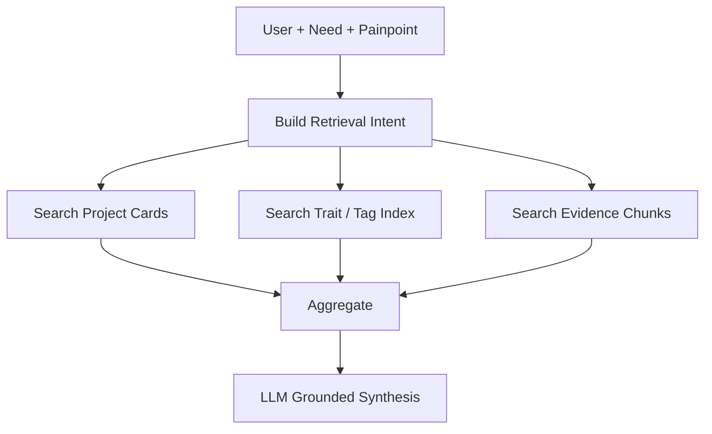

# Hướng dẫn implement kiến trúc 2 routes cho trợ lý tư vấn bất động sản

## 1. Mục tiêu

Tài liệu này mô tả cách triển khai một **trợ lý tư vấn viên bất động sản** theo mô hình **2 routes**:

1. **Consult / Discovery Route**
   - Dùng khi khách hỏi rộng, chưa đủ tiêu chí để search dự án.
   - Mục tiêu là trò chuyện tự nhiên, làm rõ `need` và `painpoint`, đồng thời khơi gợi thêm sự tò mò để khách hỏi sâu hơn.

2. **Project Grounded Route**
   - Dùng khi câu hỏi đã đủ cụ thể để truy xuất dữ liệu dự án.
   - Mục tiêu là trả lời có grounding từ knowledge base dự án, giải thích vì sao phù hợp, kèm điểm mạnh và trade-off.

> Trợ lý này **không phải bot bán hàng**. Nó phải đóng vai trò người đồng hành tư vấn: nhẹ nhàng, có chiều sâu, không ép mua, không biến hội thoại thành form điền thông tin.

---

## 2. Khi nào nên dùng kiến trúc 2 routes

Kiến trúc này phù hợp khi:

- Chưa có playbook tư vấn quá rõ ràng để retrieval riêng.
- Muốn LLM có thể **tự tư vấn ở mức khung** với các câu hỏi rộng.
- Muốn chỉ retrieve dự án khi thực sự cần grounding.
- Muốn lưu state tối giản, không dùng quá nhiều field cứng.

Không phù hợp nếu:

- Bạn cần hệ thống hoạt động như CRM qualification form.
- Bạn muốn control tuyệt đối từng câu tư vấn bằng rule-based flow cứng.

---

## 3. State tối giản nên lưu

Chỉ cần 4 field business-level:

```json
{
  "name": null,
  "phone_contact": null,
  "need": {
    "summary": "",
    "topics": [],
    "evidence": [],
    "last_updated_at": null
  },
  "painpoint": {
    "summary": "",
    "topics": [],
    "evidence": [],
    "last_updated_at": null
  }
}
```

### Giải thích

- `name`: tên khách, nếu có.
- `phone_contact`: số điện thoại/Zalo liên hệ, chỉ lấy khi hợp lý.
- `need`: bức tranh nhu cầu hiện tại.
- `painpoint`: bức tranh nỗi lo/rào cản hiện tại.

### Cấu trúc khuyên dùng cho `need` và `painpoint`

```json
{
  "summary": "Khách đang tìm căn hộ để ở cho gia đình, ưu tiên môi trường sống thuận tiện và phù hợp với gia đình có con nhỏ.",
  "topics": [
    {"label": "mua để ở", "weight": 0.95},
    {"label": "gia đình có con nhỏ", "weight": 0.88},
    {"label": "môi trường sống", "weight": 0.81}
  ],
  "evidence": [
    "Nhà mình có bé nhỏ nên muốn chỗ ở ổn một chút",
    "Mình ưu tiên đi lại đỡ vất"
  ],
  "last_updated_at": "2026-04-15T10:30:00+07:00"
}
```

> Không cần bẻ nhỏ `need` và `painpoint` thành quá nhiều field. Hãy để LLM cập nhật 2 khối này như **semantic summaries có trọng số chủ đề**.

---

## 4. Tổng quan kiến trúc



---

## 5. Router logic

### 5.1. Ý tưởng

Router không nên hỏi: “Có retrieve được không?”

Router nên hỏi:

1. Đây là câu hỏi **tư vấn định hướng** hay **tìm dự án cụ thể**?
2. Câu hỏi đã đủ rõ để project retrieval chưa?
3. Lượt này nên làm rõ thêm hay đã có thể grounding dự án?

### 5.2. 3 loại query chính

#### A. Advisory Strategy
Ví dụ:
- “Mình muốn được tư vấn, mua để đầu tư thì nên chọn thế nào?”
- “Mình nên bắt đầu từ đâu?”
- “Mua để ở thì nên ưu tiên điều gì?”

Đi route:
- `consult_discovery`

#### B. Project Matching
Ví dụ:
- “Có căn nào gần trường học và bệnh viện không?”
- “Dự án nào phù hợp đầu tư an toàn?”
- “Có khu nào hợp gia đình có con nhỏ?”

Đi route:
- `project_grounded`

#### C. Project Specific
Ví dụ:
- “Dự án A có pháp lý thế nào?”
- “Dự án B nổi bật ở điểm gì?”
- “Giá ở dự án C khoảng bao nhiêu?”

Đi route:
- `project_grounded`

### 5.3. Rule tối giản

```python
if user_query_is_general_strategy_or_open_ended:
    route = "consult_discovery"
elif user_query_mentions_specific_project_or_clear_filters:
    route = "project_grounded"
else:
    route = "consult_discovery"
```

---

## 6. Consult / Discovery Route

## 6.1. Mục tiêu

Route này dùng khi khách hỏi rộng, chưa đủ tiêu chí để tra cứu dự án.

Mục tiêu:
- Làm khách thấy được hiểu.
- Tạo một khung nghĩ ngắn gọn.
- Gợi thêm tò mò về lựa chọn phù hợp.
- Cập nhật `need` và `painpoint`.
- Chuẩn bị điều kiện để chuyển sang `project_grounded`.

## 6.2. Không nên làm gì

- Không bịa thông tin dự án.
- Không kể tên dự án vô tội vạ khi chưa có tiêu chí.
- Không hỏi dồn như form.
- Không xin số điện thoại quá sớm.
- Không chốt lịch kiểu ép buộc.

## 6.3. Prompt mục tiêu cho route này

```text
Bạn là trợ lý tư vấn viên bất động sản, không phải bot bán hàng.

Khi người dùng hỏi rộng hoặc chưa đủ tiêu chí để tra cứu dự án:
- Hãy tư vấn ở mức nguyên tắc, giúp họ nhìn rõ cách chọn hoặc góc nhìn phù hợp.
- Không bịa thông tin dự án cụ thể.
- Mỗi lượt chỉ mở một góc nhìn chính.
- Giọng điệu nhẹ nhàng, tinh tế, đồng hành, không ép mua.
- Phản hồi nên làm được ít nhất một trong ba việc: tăng trust, tăng clarity, hoặc tăng curiosity.
- Nếu phù hợp, kết thúc bằng một câu hỏi mở ngắn để làm rõ thêm nhu cầu.

Ngoài câu trả lời cho người dùng, hãy xuất thêm JSON:
- need_update
- painpoint_update
- routing_signal
```

## 6.4. Output schema khuyên dùng

```json
{
  "assistant_reply": "...",
  "need_update": {
    "summary_delta": "...",
    "topics": [
      {"label": "đầu tư", "weight": 0.94},
      {"label": "an toàn", "weight": 0.72}
    ],
    "evidence": ["..."]
  },
  "painpoint_update": {
    "summary_delta": "...",
    "topics": [
      {"label": "sợ chọn sai", "weight": 0.81}
    ],
    "evidence": ["..."]
  },
  "routing_signal": {
    "should_route_project": false,
    "project_query_hint": null,
    "reason": "Chưa đủ tiêu chí để grounding vào dự án cụ thể"
  }
}
```

## 6.5. Ví dụ xử lý

### Input
> “Mình muốn được tư vấn, mình muốn mua với mục đích để đầu tư thì nên lựa chọn như thế nào là hợp lý”

### Hướng phản hồi tốt
- Khung tư duy: đầu tư an toàn / thanh khoản / tăng trưởng.
- Không nhảy vào dự án ngay.
- Hỏi mở 1 câu nhẹ để hiểu lens đầu tư.

### Ví dụ assistant_reply
> Nếu mình mua với mục đích đầu tư thì thường không nên nhìn một yếu tố đơn lẻ như giá hay vị trí thôi, mà nên nhìn theo 3 hướng chính: mức độ an toàn khi xuống tiền, khả năng giữ giá/thanh khoản, và dư địa tăng trưởng theo khu vực.  
> Có những sản phẩm hợp với kiểu đầu tư an toàn, giữ tài sản ổn định; cũng có loại phù hợp hơn nếu mình chấp nhận biên độ cao hơn để đổi lấy kỳ vọng tăng trưởng.  
> Để em định hướng sát hơn cho mình, anh/chị đang nghiêng về kiểu đầu tư an toàn hay muốn tìm phương án có tiềm năng tăng trưởng mạnh hơn?

---

## 7. Điều kiện chuyển từ Consult sang Project

Chỉ nên route sang project khi có ít nhất một trong ba điều kiện:

### A. Khách đã lộ “lens” đủ rõ
Ví dụ:
- đầu tư an toàn
- đầu tư tăng trưởng
- gia đình có con nhỏ
- ưu tiên trường học
- ưu tiên pháp lý

### B. Khách đã hỏi bằng tiêu chí có thể truy xuất
Ví dụ:
- gần trường học
- gần bệnh viện
- khu Đông
- phù hợp cho thuê

### C. Khách chủ động hỏi lựa chọn thực tế
Ví dụ:
- “Vậy có dự án nào hợp?”
- “Khu nào nên xem?”
- “Có căn nào như vậy không?”

### Rule tối giản

```python
should_route_project = (
    user_query_has_clear_project_filters
    or user_asks_for_real_options
    or extracted_need_is_specific_enough
)
```

---

## 8. Project Grounded Route

## 8.1. Mục tiêu

Route này dùng khi đã có đủ tiêu chí để lấy dữ liệu dự án.

Mục tiêu:
- Trả lời có grounding.
- Lấy ra dự án/căn hộ phù hợp.
- Nêu điểm mạnh, điểm cần cân nhắc, trade-off.
- Tiếp tục cập nhật `need` và `painpoint`.

## 8.2. Retrieval ở route này nên lấy gì

Không chỉ retrieve chunk văn bản. Nên retrieve 3 lớp:

### A. Project Cards
Tóm tắt cấp dự án:
- dự án hợp ai
- mạnh ở đâu
- có điểm cần cân nhắc gì
- các tag nổi bật

### B. Evidence Chunks
Bằng chứng gốc từ tài liệu:
- brochure
- bảng giá
- pháp lý
- tiện ích
- vị trí
- khu vực lân cận

### C. Trade-off / Traits
Thông tin suy ra từ facts:
- hợp gia đình có con nhỏ
- hợp đầu tư an toàn
- vào trung tâm hơi xa
- tiện ích gia đình mạnh
- phù hợp ở lâu dài hơn đầu cơ ngắn hạn

## 8.3. Prompt mục tiêu cho route này

```text
Bạn là trợ lý tư vấn viên bất động sản.

Bạn đang có dữ liệu dự án đã được retrieve. Hãy:
- Chỉ dựa trên dữ liệu được cung cấp.
- Trả lời như một consultant đồng hành, không như brochure quảng cáo.
- Nêu rõ vì sao lựa chọn phù hợp với điều người dùng đang quan tâm.
- Có thể nêu điểm cần cân nhắc dưới dạng trade-off, không phán xét tuyệt đối.
- Nếu chưa đủ dữ liệu, nói rõ chưa đủ cơ sở.
- Nếu phù hợp, gợi mở một câu hỏi tiếp theo để làm rõ thêm nhu cầu.
```

## 8.4. Output schema khuyên dùng

```json
{
  "assistant_reply": "...",
  "used_projects": ["project_a", "project_b"],
  "need_update": {
    "summary_delta": "...",
    "topics": [
      {"label": "trường học", "weight": 0.84},
      {"label": "bệnh viện", "weight": 0.79}
    ],
    "evidence": ["..."]
  },
  "painpoint_update": {
    "summary_delta": "...",
    "topics": [
      {"label": "thuận tiện sinh hoạt", "weight": 0.76}
    ],
    "evidence": ["..."]
  }
}
```

## 8.5. Ví dụ xử lý

### Input
> “Có những căn hộ nào gần khu vực trường học và bệnh viện?”

### Retrieval intent
- gần trường học
- gần bệnh viện
- likely family-friendly
- ưu tiên vị trí sống thuận tiện

### Hướng phản hồi tốt
- Trả shortlist.
- Nêu lý do phù hợp.
- Nêu điểm cần cân nhắc nếu có.
- Gợi mở nhẹ để hiểu thêm: nhu cầu ở thực hay đầu tư, con nhỏ hay không, khu vực ưu tiên.

---

## 9. Thiết kế retrieval cho Project Grounded Route

## 9.1. Không nên chỉ dùng RAG thường

Không nên chỉ làm:

`document -> chunk -> vector search -> top-k`

Vì cách này khó trả lời ổn định các ý như:
- điểm mạnh dự án
- điểm cần cân nhắc
- dự án hợp kiểu khách nào
- trade-off giữa các lựa chọn

## 9.2. Nên ingest ra 3 đầu ra

### A. Raw Chunks
Để làm evidence gốc.

### B. Project Card
Ví dụ:

```json
{
  "project_id": "du_an_a",
  "summary": "Dự án căn hộ phù hợp gia đình trẻ ở khu Đông.",
  "strengths": [
    "gần trục giao thông chính",
    "tiện ích nội khu mạnh",
    "môi trường sống ổn định"
  ],
  "tradeoffs": [
    "giá nhỉnh hơn mặt bằng cùng khu",
    "không tối ưu nếu phải vào trung tâm mỗi ngày"
  ],
  "fit_personas": [
    "gia đình có con nhỏ",
    "người mua để ở lâu dài"
  ]
}
```

### C. Trait / Tag Index
Ví dụ tag:
- `family_friendly`
- `investor_fit`
- `near_school`
- `near_hospital`
- `legal_safe`
- `premium_pricing`
- `central_commute_heavy`

## 9.3. Query flow



---

## 10. Pseudo-code orchestration

```python
def handle_user_message(user_message, lead_state, recent_history):
    route = classify_route(user_message, lead_state, recent_history)

    if route == "consult_discovery":
        consult_result = run_consult_discovery(
            user_message=user_message,
            lead_state=lead_state,
            recent_history=recent_history,
        )

        lead_state = merge_updates(
            lead_state,
            consult_result["need_update"],
            consult_result["painpoint_update"],
        )

        if consult_result["routing_signal"]["should_route_project"]:
            retrieval_intent = consult_result["routing_signal"]["project_query_hint"]
            grounded_result = run_project_grounded(
                user_message=user_message,
                retrieval_intent=retrieval_intent,
                lead_state=lead_state,
                recent_history=recent_history,
            )
            lead_state = merge_updates(
                lead_state,
                grounded_result["need_update"],
                grounded_result["painpoint_update"],
            )
            return grounded_result["assistant_reply"], lead_state

        return consult_result["assistant_reply"], lead_state

    elif route == "project_grounded":
        retrieval_intent = build_retrieval_intent(user_message, lead_state, recent_history)
        grounded_result = run_project_grounded(
            user_message=user_message,
            retrieval_intent=retrieval_intent,
            lead_state=lead_state,
            recent_history=recent_history,
        )
        lead_state = merge_updates(
            lead_state,
            grounded_result["need_update"],
            grounded_result["painpoint_update"],
        )
        return grounded_result["assistant_reply"], lead_state
```

---

## 11. Merge logic cho `need` và `painpoint`

## 11.1. Merge summary

Không overwrite thô. Nên:
- dùng summary mới như “delta”
- hoặc cuối mỗi phiên chạy một bước re-summarize ngắn

## 11.2. Merge topics

Nếu topic đã tồn tại:
- cập nhật weight bằng weighted average hoặc max-clipped average
- thêm evidence mới nếu chưa trùng

Ví dụ:

```python
def merge_topics(old_topics, new_topics):
    # key theo label
    # nếu trùng label, cập nhật weight và gộp evidence
    pass
```

## 11.3. Merge evidence

Giữ tối đa 5-10 evidence gần nhất và có giá trị nhất.

---

## 12. Hỏi tên và số điện thoại khi nào

## 12.1. Name
Có thể hỏi tương đối sớm nếu cần xưng hô tự nhiên.

Ví dụ:
- “Em tiện xưng hô với anh/chị thế nào cho tự nhiên nhỉ?”

## 12.2. Phone Contact
Chỉ hỏi khi có utility rõ ràng.

Ví dụ:
- gửi shortlist cá nhân hóa
- gửi brochure/floor plan
- kết nối chuyên viên
- đặt lịch xem

Không nên hỏi sớm nếu chưa tạo trust.

---

## 13. KPI nên đo

### Chất lượng hội thoại
- tỷ lệ khách phản hồi sau 3 lượt
- độ sâu hội thoại
- tỷ lệ khách hỏi tiếp về lựa chọn thực tế

### Chất lượng hiểu khách
- need summary có rõ dần không
- painpoint có nhất quán không
- số topic hữu ích được trích xuất qua nhiều phiên

### Chất lượng route
- tỷ lệ route đúng từ consult sang project
- tỷ lệ retrieve đúng dự án khi khách hỏi cụ thể
- tỷ lệ phản hồi grounded vs non-grounded hợp lý

### Chuyển đổi mềm
- tỷ lệ khách chủ động hỏi thêm về sản phẩm
- tỷ lệ khách xin shortlist / brochure / tài liệu
- tỷ lệ khách đồng ý để lại contact ở bước hợp lý

---

## 14. MVP implementation roadmap

## Phase 1
- Implement 2 routes.
- Lưu state 4 field: `name`, `phone_contact`, `need`, `painpoint`.
- Consult route dùng LLM reasoning + JSON extraction.
- Project route dùng retrieval trên tài liệu dự án.

## Phase 2
- Ingest thêm `project_cards` và `trait_tags`.
- Cải thiện retrieval intent builder.
- Cải thiện merge logic cho topics/evidence.

## Phase 3
- Thêm session summarizer cuối phiên.
- Thêm reranking project cards theo need/painpoint.
- Thêm logic trigger contact capture và human handoff.

---

## 15. Kết luận

Mô hình 2 routes là cách thực dụng để triển khai một **trợ lý tư vấn bất động sản** khi:
- chưa có playbook tư vấn hoàn chỉnh,
- vẫn muốn LLM nói chuyện tự nhiên,
- nhưng vẫn cần kiểm soát flow và chỉ grounding dự án khi hợp lý.

### Tư duy chốt

- **Consult / Discovery Route**: LLM tự tư vấn có kiểm soát, làm rõ nhu cầu và pain point, tạo tò mò.
- **Project Grounded Route**: Retrieval + synthesis để tư vấn cụ thể dựa trên dữ liệu dự án.
- **State tối giản**: chỉ cần `name`, `phone_contact`, `need`, `painpoint`.
- **Retrieval tốt**: không chỉ trả chunk, mà nên trả được project card, traits, evidence và trade-offs.

Nếu cần mở rộng sau này, có thể thêm:
- session summarization,
- trait extraction nâng cao,
- router classifier tốt hơn,
- project ranking theo `need` và `painpoint`.
