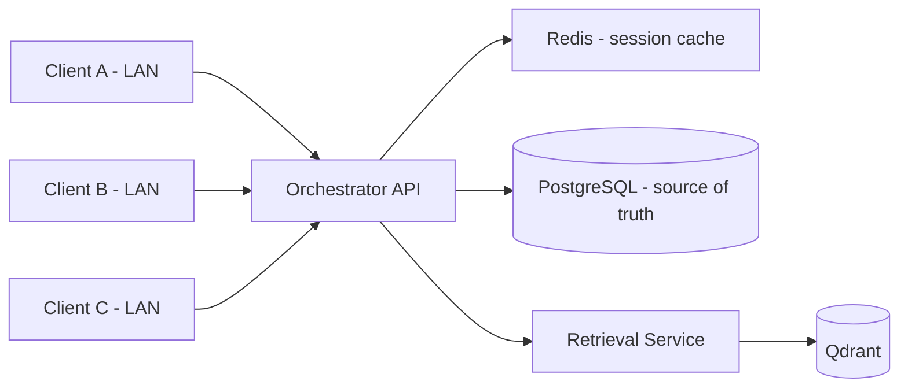

# Hướng dẫn thiết kế DB trên server và cấp quyền truy cập từ các máy trong LAN

## 1. Mục tiêu

Tài liệu này mô tả cách triển khai lưu trữ hội thoại theo mô hình:

- **PostgreSQL**: lưu dữ liệu bền vững (customer, conversation, message, snapshot state).
- **Redis**: lưu context phiên đang hoạt động để tối ưu tốc độ phản hồi.
- **Orchestrator API**: điểm truy cập duy nhất cho các máy trong LAN (không truy cập DB trực tiếp).

Mục tiêu là để các máy trong mạng LAN có thể gọi theo `customer_id` và luôn nhận đúng ngữ cảnh chat/history hiện tại.

---

## 2. Kiến trúc đề xuất



Nguyên tắc:

1. **Mọi máy LAN chỉ gọi API** (HTTP nội bộ).
2. **PostgreSQL là nguồn dữ liệu chuẩn** (source of truth).
3. **Redis chỉ là cache phiên**, có TTL.

---

## 3. Thiết kế dữ liệu PostgreSQL

## 3.1. Bảng chính

```sql
CREATE TABLE customers (
    id               BIGSERIAL PRIMARY KEY,
    external_customer_id VARCHAR(128) NOT NULL UNIQUE,
    name             VARCHAR(255),
    phone_contact    VARCHAR(32),
    created_at       TIMESTAMPTZ NOT NULL DEFAULT NOW(),
    updated_at       TIMESTAMPTZ NOT NULL DEFAULT NOW()
);

CREATE TABLE conversations (
    id               BIGSERIAL PRIMARY KEY,
    customer_id      BIGINT NOT NULL REFERENCES customers(id),
    status           VARCHAR(32) NOT NULL DEFAULT 'active',
    started_at       TIMESTAMPTZ NOT NULL DEFAULT NOW(),
    ended_at         TIMESTAMPTZ,
    created_at       TIMESTAMPTZ NOT NULL DEFAULT NOW(),
    updated_at       TIMESTAMPTZ NOT NULL DEFAULT NOW()
);

CREATE TABLE messages (
    id               BIGSERIAL PRIMARY KEY,
    conversation_id  BIGINT NOT NULL REFERENCES conversations(id),
    turn_index       INT NOT NULL,
    role             VARCHAR(16) NOT NULL CHECK (role IN ('user', 'assistant', 'system')),
    route            VARCHAR(32),
    content          TEXT NOT NULL,
    payload_json     JSONB,
    created_at       TIMESTAMPTZ NOT NULL DEFAULT NOW(),
    UNIQUE (conversation_id, turn_index)
);

CREATE TABLE lead_state_snapshots (
    id               BIGSERIAL PRIMARY KEY,
    conversation_id  BIGINT NOT NULL REFERENCES conversations(id),
    message_id       BIGINT REFERENCES messages(id),
    lead_state_json  JSONB NOT NULL,
    created_at       TIMESTAMPTZ NOT NULL DEFAULT NOW()
);
```

## 3.2. Index khuyến nghị

```sql
CREATE INDEX idx_customers_external_id ON customers(external_customer_id);
CREATE INDEX idx_conversations_customer ON conversations(customer_id, status, updated_at DESC);
CREATE INDEX idx_messages_conv_created ON messages(conversation_id, created_at);
CREATE INDEX idx_messages_conv_turn ON messages(conversation_id, turn_index);
CREATE INDEX idx_snapshots_conv_created ON lead_state_snapshots(conversation_id, created_at DESC);
```

---

## 4. Thiết kế Redis cho phiên active

Key đề xuất:

- `chat:customer:{external_customer_id}:context`
  - value: JSON gồm `conversation_id`, `recent_messages`, `lead_state`, `updated_at`
  - TTL: 30-120 phút (tùy tải và vòng đời session)

- `chat:customer:{external_customer_id}:lock`
  - value: request id
  - TTL ngắn (10-30 giây) để tránh race condition khi nhiều máy cùng ghi một khách

Mẫu payload:

```json
{
  "conversation_id": 12345,
  "recent_messages": [
    {"role": "user", "content": "Mình mua để ở, gần trường học"},
    {"role": "assistant", "content": "Mình ưu tiên khu vực nào trước?"}
  ],
  "lead_state": {
    "name": "Nam",
    "phone_contact": "0912345678",
    "need": {"summary": "...", "topics": [], "evidence": [], "last_updated_at": "2026-04-15T10:00:00Z"},
    "painpoint": {"summary": "...", "topics": [], "evidence": [], "last_updated_at": "2026-04-15T10:00:00Z"}
  },
  "updated_at": "2026-04-15T10:00:00Z"
}
```

---

## 5. API contract cho các máy LAN

Nên expose API nội bộ ở orchestrator:

1. `POST /chat/{customer_id}/message`
   - input: message mới
   - output: assistant reply + route + updated lead_state

2. `GET /chat/{customer_id}/context`
   - output: context active hiện tại (ưu tiên Redis, fallback PostgreSQL)

3. `GET /chat/{customer_id}/history?limit=...`
   - output: lịch sử hội thoại từ PostgreSQL

Luồng xử lý chuẩn:

1. Nhận request theo `customer_id`.
2. Lấy context từ Redis; nếu miss thì load từ PostgreSQL.
3. Gọi flow orchestrator/retrieval.
4. Ghi `messages` + `lead_state_snapshots` vào PostgreSQL.
5. Cập nhật Redis context.
6. Trả response cho client gọi từ LAN.

---

## 6. Cấp quyền truy cập từ máy LAN (khuyến nghị theo mức an toàn)

## 6.1. Mức khuyến nghị (nên dùng): chỉ mở API, không mở DB

- Các máy LAN truy cập: `http://<SERVER_IP>:8021`
- Không cho các máy LAN kết nối thẳng PostgreSQL/Redis.
- PostgreSQL/Redis bind nội bộ (`127.0.0.1` hoặc docker internal network).

Ví dụ mở cổng API bằng UFW:

```bash
# chỉ cho dải LAN 192.168.1.0/24 gọi orchestrator
sudo ufw allow from 192.168.1.0/24 to any port 8021 proto tcp

# không mở 5432/6379 ra LAN
sudo ufw deny 5432/tcp
sudo ufw deny 6379/tcp
```

## 6.2. Xác thực giữa các máy trong LAN

Tối thiểu:

- Dùng `X-API-Key` theo từng máy hoặc từng ứng dụng gọi.
- Lưu hash API key ở PostgreSQL.
- Gắn quota/rate limit theo key.

Nâng cao:

- mTLS giữa client LAN và server.
- Reverse proxy (Nginx/Traefik) để kiểm soát IP allowlist + auth tập trung.

---

## 7. Cấu hình triển khai server (gợi ý docker compose)

```yaml
services:
  postgres:
    image: postgres:16
    environment:
      POSTGRES_DB: noble_chat
      POSTGRES_USER: noble_user
      POSTGRES_PASSWORD: ${POSTGRES_PASSWORD}
    volumes:
      - ./volumes/postgres:/var/lib/postgresql/data
    expose:
      - "5432"
    restart: unless-stopped

  redis:
    image: redis:7
    command: ["redis-server", "--appendonly", "yes"]
    volumes:
      - ./volumes/redis:/data
    expose:
      - "6379"
    restart: unless-stopped

  orchestrator-service:
    # giữ như hiện tại, thêm env kết nối postgres/redis
    ports:
      - "0.0.0.0:8021:8021"
    depends_on:
      - postgres
      - redis
    restart: unless-stopped
```

Lưu ý:

- `expose` cho DB/cache là đủ trong nội bộ docker network.
- Chỉ `orchestrator-service` publish port ra LAN.

---

## 8. Chính sách backup và vận hành

Tối thiểu:

1. PostgreSQL: backup hằng ngày bằng `pg_dump`, giữ ít nhất 7-14 bản.
2. Redis: bật AOF hoặc snapshot định kỳ.
3. Log truy cập API: lưu request id, customer_id, route, status code.
4. Health endpoints: theo dõi `/health` của orchestrator/retrieval.

---

## 9. Checklist triển khai nhanh

1. Triển khai PostgreSQL + Redis trên server.
2. Thêm schema bảng chat history trong PostgreSQL.
3. Thêm tầng repository trong orchestrator để ghi/đọc history.
4. Thêm cache Redis cho context active.
5. Expose API nội bộ theo `customer_id`.
6. Cấu hình firewall chỉ mở cổng API cho LAN.
7. Bật API key/mTLS trước khi cho nhiều máy truy cập.

---

## 10. Kết luận

Với bài toán nhiều máy trong LAN cùng truy cập theo `customer_id`, mô hình phù hợp nhất là:

- **PostgreSQL** cho lịch sử hội thoại bền vững.
- **Redis** cho tốc độ xử lý phiên active.
- **Orchestrator API** làm cổng truy cập duy nhất.

Thiết kế này giúp dữ liệu đồng nhất, tốc độ tốt, dễ mở rộng và an toàn hơn so với cho máy LAN truy cập thẳng DB.
