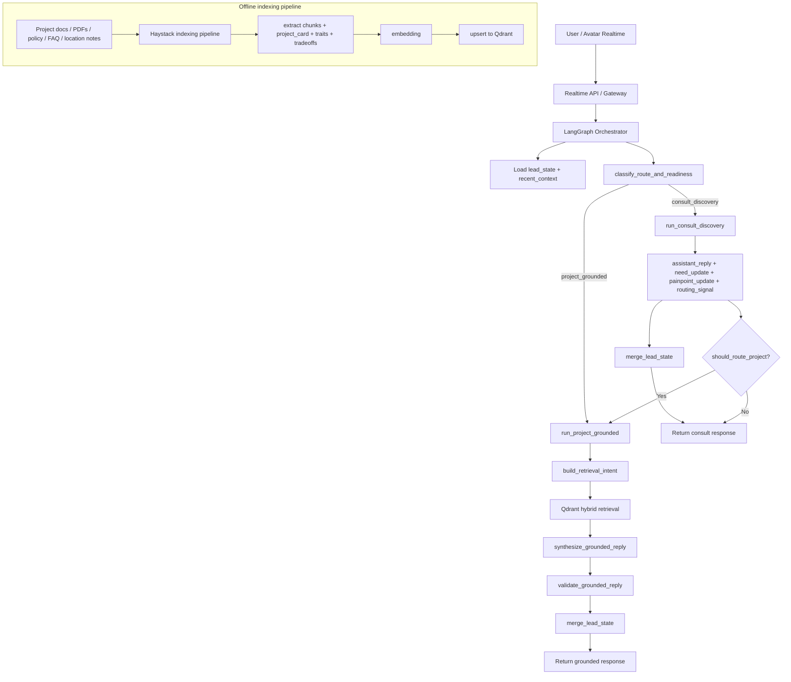
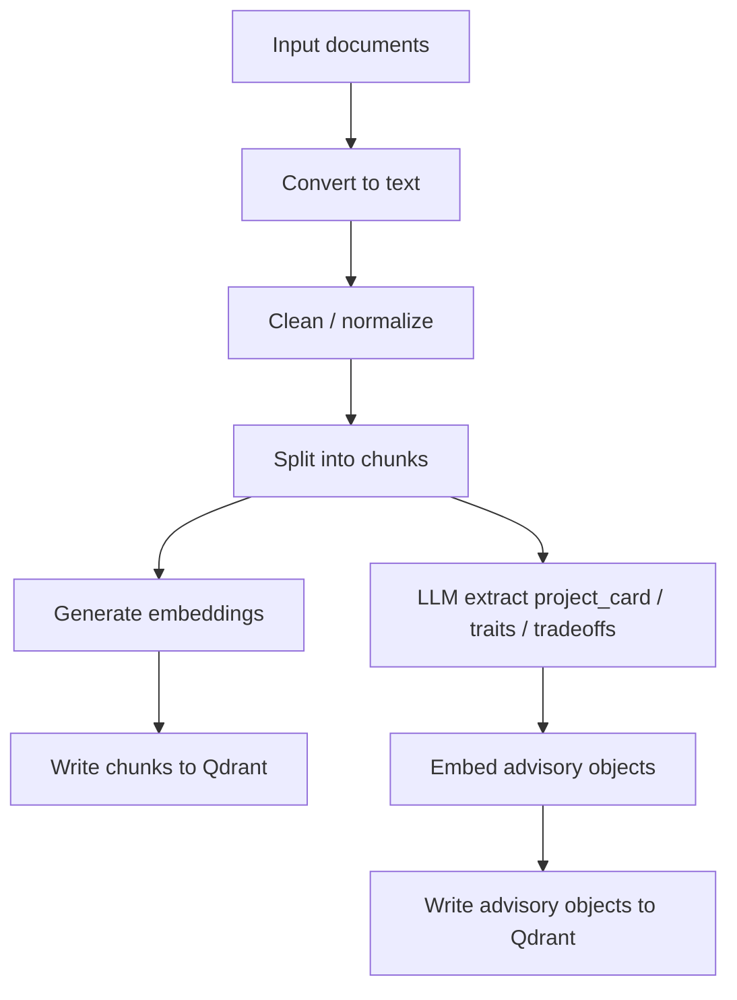

# Kiến trúc triển khai LangGraph + Qdrant + Haystack (offline) cho trợ lý tư vấn bất động sản realtime

## 1. Mục tiêu

Tài liệu này mô tả kiến trúc triển khai cho một **trợ lý tư vấn bất động sản** có 2 route chính:

- `consult_discovery`: trò chuyện tự nhiên để hiểu khách hàng, làm rõ `need` và `painpoint`, đồng thời gợi mở để khách hỏi sâu hơn.
- `project_grounded`: trả lời có grounding từ dữ liệu dự án đã ingest.

Hệ thống phải:

- giữ đúng workflow 2 routes đã thống nhất
- phản hồi thật nhanh để nối vào avatar interactive realtime
- không biến thành chatbot FAQ hoặc bot bán hàng ép mua
- không phụ thuộc vào một “RAG framework all-in-one” trên hot path

## 2. Nguyên tắc kiến trúc

### 2.1. Tách online path và offline path

**Online path** phải cực mỏng:

- nhận message
- đọc state
- route đúng
- chỉ retrieval khi thật sự cần
- synthesize câu trả lời ngắn, tự nhiên, grounded nếu cần

**Offline path** làm nặng thay cho online:

- parse tài liệu dự án
- chunk / normalize dữ liệu
- trích xuất `project_card`, `trait`, `tradeoff`, `evidence_chunk`
- embed và upsert vào Qdrant

### 2.2. LangGraph không thay RAG

- **LangGraph** chỉ làm orchestration: state, routing, node execution, merge state
- **Qdrant** là vector/hybrid retrieval backend
- **RAG** chính là route `project_grounded`
- **Haystack** chỉ hỗ trợ offline indexing pipeline, không nằm trên hot path realtime

### 2.3. State tối giản

Giữ state business-level tối giản:

- `name`
- `phone_contact`
- `need`
- `painpoint`

Trong đó `need` và `painpoint` là trường mở, được LLM cập nhật dần từ lịch sử trò chuyện.

---

## 3. Kiến trúc tổng thể



---

## 4. Vai trò của từng thành phần

## 4.1. LangGraph

LangGraph là framework orchestration chính, chịu trách nhiệm:

- đọc `lead_state`
- đọc `recent_context`
- route sang `consult_discovery` hoặc `project_grounded`
- merge state sau mỗi turn
- quyết định khi nào được phép retrieval dự án
- điều phối nodes theo workflow cố định

LangGraph **không** là vector DB và **không** tự làm retrieval.

## 4.2. Qdrant

Qdrant là backend cho retrieval, dùng để lưu và truy vấn:

- `project_card`
- `trait`
- `tradeoff`
- `evidence_chunk`

Qdrant nên được dùng cho:

- dense retrieval
- hybrid retrieval
- metadata filtering
- candidate recall nhanh cho route `project_grounded`

## 4.3. Haystack (offline only)

Haystack chỉ dùng cho pipeline xử lý dữ liệu trước khi đưa vào Qdrant:

- đọc file
- chuyển đổi / clean text
- split text
- tạo `Document`
- ghi sang `QdrantDocumentStore`

Haystack **không chạy trên đường online realtime**.

## 4.4. LLM

LLM được dùng ở 3 chỗ chính:

1. `consult_discovery`
2. `build_retrieval_intent`
3. `synthesize_grounded_reply`

LLM không nên bị dùng để:

- tự bịa fact dự án
- tự suy luận ưu/nhược điểm từ raw docs ở mọi turn
- chạy retrieval nhiều vòng trên hot path

---

## 5. Workflow online

## 5.1. Input

Input mỗi turn gồm:

```json
{
  "message": "...",
  "lead_state": {
    "name": null,
    "phone_contact": null,
    "need": {
      "summary": "",
      "topics": [],
      "evidence": []
    },
    "painpoint": {
      "summary": "",
      "topics": [],
      "evidence": []
    }
  },
  "recent_context": {
    "recent_messages": [],
    "last_route": "consult_discovery",
    "last_assistant_reply": "..."
  }
}
```

## 5.2. Route 1: `consult_discovery`

### Mục tiêu

- trò chuyện như trợ lý tư vấn
- không ép bán
- làm rõ `need` và `painpoint`
- tạo tò mò để khách hỏi sâu hơn
- chỉ route sang project khi đã đủ clarity

### Những việc route này làm

- phản chiếu đúng mối quan tâm của khách
- thêm một góc nhìn có ích
- hỏi mở rất nhẹ nếu cần
- cập nhật `need_update`
- cập nhật `painpoint_update`
- sinh `routing_signal`

### Output mẫu

```json
{
  "assistant_reply": "...",
  "need_update": {
    "summary_delta": "Khách đang muốn đầu tư và cần khung đánh giá hợp lý.",
    "topics": [
      {"label": "đầu tư", "weight": 0.95},
      {"label": "tiêu chí lựa chọn", "weight": 0.82}
    ],
    "evidence": ["Mình muốn mua với mục đích để đầu tư"]
  },
  "painpoint_update": {
    "summary_delta": "Khách chưa rõ nên đánh giá cơ hội đầu tư theo hướng nào.",
    "topics": [
      {"label": "sợ chọn sai", "weight": 0.78},
      {"label": "thiếu framework", "weight": 0.80}
    ],
    "evidence": ["nên lựa chọn như thế nào là hợp lý"]
  },
  "routing_signal": {
    "should_route_project": false,
    "project_query_hint": null,
    "next_curiosity_angle": "investment_style"
  },
  "response_mode": "enrich"
}
```

### Khi nào consult được phép route sang project

Chỉ route sang `project_grounded` nếu có ít nhất một trong các điều kiện:

- khách hỏi về dự án, khu vực, tiện ích, pháp lý, khoảng cách, trường học, bệnh viện...
- khách đã lộ lens đủ rõ, ví dụ: `đầu tư an toàn`, `gia đình có con nhỏ`, `ưu tiên gần trường học`
- khách chủ động hỏi lựa chọn cụ thể: `vậy có dự án nào hợp không?`

## 5.3. Route 2: `project_grounded`

### Mục tiêu

- lấy dữ liệu dự án phù hợp từ Qdrant
- trả lời grounded theo ngữ cảnh khách hàng
- không chỉ liệt kê brochure
- nêu được điểm mạnh / điểm cần cân nhắc / mức độ phù hợp

### Các bước

1. `build_retrieval_intent`
2. query Qdrant
3. lấy `project_card` + `evidence_chunk`
4. synthesize grounded reply
5. validate grounded reply
6. merge state

### Retrieval intent mẫu

```json
{
  "persona_hint": "cautious_investor",
  "topic_focus": ["capital_preservation", "liquidity", "legal_safety"],
  "location_hint": null,
  "query_text": "Các dự án/căn hộ phù hợp đầu tư an toàn, giữ giá, thanh khoản tốt",
  "filters": {
    "project_tags": ["investor_fit", "legal_safety"],
    "status": ["active"]
  },
  "top_k": 6
}
```

### Output mẫu

```json
{
  "assistant_reply": "...",
  "need_update": {
    "summary_delta": "Khách nghiêng về đầu tư an toàn hơn là tăng trưởng rủi ro cao.",
    "topics": [
      {"label": "đầu tư an toàn", "weight": 0.90}
    ]
  },
  "painpoint_update": {
    "summary_delta": "Khách cần sự an tâm về pháp lý và thanh khoản.",
    "topics": [
      {"label": "pháp lý", "weight": 0.76},
      {"label": "thanh khoản", "weight": 0.83}
    ]
  },
  "retrieved_projects": ["project_a", "project_b"],
  "route": "project_grounded"
}
```

---

## 6. Router logic

Không nên route chỉ dựa trên intent bề mặt. Nên route theo:

- loại câu hỏi
- độ rõ để grounding

### Pseudo-code

```python
from typing import Literal

Route = Literal["consult_discovery", "project_grounded"]


def classify_route(message: str, lead_state: dict, recent_context: dict) -> Route:
    msg = message.lower()

    project_signals = [
        "dự án", "căn hộ", "gần trường", "gần bệnh viện", "pháp lý",
        "khu vực", "quận", "tiện ích", "có căn nào", "giá bao nhiêu"
    ]
    advisory_signals = [
        "nên chọn", "hợp lý", "nên đầu tư thế nào", "tư vấn giúp", "nên lựa chọn như thế nào"
    ]

    if any(s in msg for s in project_signals):
        return "project_grounded"

    if any(s in msg for s in advisory_signals):
        return "consult_discovery"

    # fallback: nếu need/painpoint còn mơ hồ thì ưu tiên consult
    if not lead_state.get("need", {}).get("summary"):
        return "consult_discovery"

    return "consult_discovery"
```

### Lưu ý

Router thực tế nên dùng LLM classifier hoặc rule + LLM hybrid, nhưng nguyên tắc vẫn là:

- chưa đủ clarity -> `consult_discovery`
- đã có retrieval intent đủ rõ -> `project_grounded`

---

## 7. Thiết kế dữ liệu trong Qdrant

Nên tách ít nhất 2 loại object chính.

## 7.1. `project_card`

Mỗi project có một bản tóm tắt tư vấn cấp cao.

```json
{
  "id": "project_card::du_an_a",
  "type": "project_card",
  "project_id": "du_an_a",
  "title": "Dự án A",
  "summary": "Dự án căn hộ trung cao cấp tại khu Đông, phù hợp gia đình trẻ và người mua để ở lâu dài.",
  "strengths": [
    "kết nối tốt tới các trục giao thông chính",
    "nhiều tiện ích nội khu",
    "phù hợp gia đình cần môi trường sống ổn định"
  ],
  "tradeoffs": [
    "giá nhỉnh hơn mặt bằng cùng khu",
    "ít phù hợp nếu đi trung tâm hằng ngày"
  ],
  "fit_personas": [
    "young_family",
    "owner_occupier",
    "cautious_investor"
  ],
  "tags": [
    "family_friendly",
    "near_school",
    "near_hospital",
    "investor_fit"
  ],
  "metadata": {
    "area": "Thu Duc",
    "product_types": ["apartment"],
    "status": "active"
  }
}
```

## 7.2. `evidence_chunk`

Các chunk gốc để hỗ trợ grounding.

```json
{
  "id": "evidence::du_an_a::chunk_001",
  "type": "evidence_chunk",
  "project_id": "du_an_a",
  "text": "Dự án nằm cách bệnh viện X 8 phút di chuyển và gần cụm trường học Y...",
  "source": {
    "doc_name": "brochure_du_an_a.pdf",
    "page": 4
  },
  "metadata": {
    "area": "Thu Duc",
    "topics": ["school", "hospital", "location"]
  }
}
```

### Khuyến nghị collection

Có thể dùng 1 collection với payload `type`, hoặc 2 collections riêng:

- `project_cards`
- `project_evidence`

Nếu ưu tiên đơn giản và nhanh triển khai, dùng **1 collection** với payload `type` là đủ.

---

## 8. Offline indexing với Haystack

## 8.1. Mục tiêu của offline pipeline

Biến tài liệu thô thành dữ liệu dễ retrieve:

- raw chunks
- project cards
- traits / tradeoffs
- embeddings

## 8.2. Pipeline đề xuất



## 8.3. Vai trò của Haystack trong pipeline

Haystack phù hợp để dựng indexing pipeline rõ ràng:

- `FileTypeRouter`
- converter
- `DocumentCleaner`
- `DocumentSplitter`
- embedder
- `DocumentWriter`
- `QdrantDocumentStore`

LLM extraction cho `project_card` / `tradeoff` có thể viết thành custom step ngoài Haystack hoặc custom component.

## 8.4. Pseudo-code offline

```python
from haystack import Pipeline
from haystack_integrations.document_stores.qdrant import QdrantDocumentStore


def offline_index_project_docs(documents: list[str]):
    # 1. create qdrant store
    document_store = QdrantDocumentStore(
        url="http://localhost:6333",
        index="real_estate_knowledge"
    )

    # 2. pipeline placeholders
    # converter -> cleaner -> splitter -> embedder -> writer
    # custom step: extract project_card / traits / tradeoffs

    # 3. write chunks
    # 4. write project_cards and advisory objects
    return document_store
```

---

## 9. Prompt strategy

## 9.1. Prompt cho `consult_discovery`

Mục tiêu:

- trò chuyện như trợ lý tư vấn
- không ép mua
- không bịa fact dự án
- làm rõ `need` và `painpoint`
- tạo tò mò để khách hỏi sâu hơn

### System prompt khung

```text
Bạn là trợ lý tư vấn bất động sản, không phải bot bán hàng.

Khi người dùng hỏi rộng hoặc chưa đủ tiêu chí để tra cứu dự án, hãy tư vấn ở mức nguyên tắc và giúp họ làm rõ hướng phù hợp.

Nguyên tắc:
- Không ép mua.
- Không hỏi dồn.
- Không bịa thông tin dự án cụ thể.
- Mỗi lượt chỉ mở một góc nhìn chính.
- Mục tiêu là khiến người dùng thấy được hiểu hơn, rõ hơn, và tự nhiên muốn hỏi sâu hơn.
- Sau câu trả lời, trích xuất need_update, painpoint_update, routing_signal.
```

## 9.2. Prompt cho `project_grounded`

Mục tiêu:

- chỉ dùng context được retrieve
- nêu điểm mạnh, điểm cần cân nhắc, mức độ phù hợp
- nói như một consultant, không như brochure

### System prompt khung

```text
Bạn là trợ lý tư vấn bất động sản.

Bạn chỉ được sử dụng dữ liệu dự án đã được retrieve trong context.
Không bịa thêm fact ngoài context.

Hãy trả lời theo cấu trúc:
1. trả lời đúng câu hỏi của khách
2. nêu 1-3 lựa chọn hoặc luận điểm phù hợp
3. với mỗi lựa chọn, giải thích ngắn vì sao phù hợp
4. nếu có trade-off quan trọng, nêu nhẹ nhàng
5. giữ giọng điệu tư vấn tự nhiên, không ép bán
```

---

## 10. Merge state

State merge nên theo nguyên tắc:

- giữ tối giản
- cộng dồn topics theo trọng số
- không ghi đè bừa nếu evidence yếu

### Hàm merge mẫu

```python
def merge_lead_state(lead_state: dict, need_update: dict | None, painpoint_update: dict | None) -> dict:
    if need_update:
        if need_update.get("summary_delta"):
            existing = lead_state["need"].get("summary", "")
            lead_state["need"]["summary"] = (existing + " " + need_update["summary_delta"]).strip()

        lead_state["need"].setdefault("topics", [])
        lead_state["need"]["topics"].extend(need_update.get("topics", []))
        lead_state["need"].setdefault("evidence", [])
        lead_state["need"]["evidence"].extend(need_update.get("evidence", []))

    if painpoint_update:
        if painpoint_update.get("summary_delta"):
            existing = lead_state["painpoint"].get("summary", "")
            lead_state["painpoint"]["summary"] = (existing + " " + painpoint_update["summary_delta"]).strip()

        lead_state["painpoint"].setdefault("topics", [])
        lead_state["painpoint"]["topics"].extend(painpoint_update.get("topics", []))
        lead_state["painpoint"].setdefault("evidence", [])
        lead_state["painpoint"]["evidence"].extend(painpoint_update.get("evidence", []))

    return lead_state
```

### Gợi ý nâng cấp sau

Khi hệ ổn định hơn, có thể thêm:

- de-duplicate topics
- decay weight theo thời gian
- normalize topic labels
- session summary ngắn sau mỗi cuộc trò chuyện

---

## 11. Tối ưu latency cho avatar realtime

## 11.1. Rule quan trọng

- `consult_discovery` mặc định **không retrieval**
- `project_grounded` mới retrieval
- tránh rerank nặng ở mọi query
- ưu tiên `project_card` trước, `evidence_chunk` sau
- prompt ngắn
- output ngắn, có thể stream

## 11.2. Gợi ý online path

### Nhanh nhất
- route `consult_discovery`
- 1 LLM call
- merge state
- stream reply

### Có grounding nhưng vẫn nhanh
- build retrieval intent
- Qdrant search top 4-6
- 1 LLM synthesis call
- validate nhẹ bằng rule
- stream reply

## 11.3. Không nên làm trên hot path

- multi-hop retrieval nhiều vòng
- graph-heavy reasoning online
- extraction ưu/nhược điểm từ raw docs mỗi lần hỏi
- chaining quá nhiều model call

---

## 12. Roadmap triển khai

## Phase 1 — MVP

- LangGraph orchestration 2 routes
- Qdrant 1 collection
- Haystack offline indexing cơ bản
- state tối giản `name`, `phone_contact`, `need`, `painpoint`
- `project_card` + `evidence_chunk`

## Phase 2 — Ổn định retrieval

- hybrid search
- metadata filters
- topic normalization cho `need` và `painpoint`
- better retrieval intent builder

## Phase 3 — Tư vấn tốt hơn

- thêm `tradeoff` objects
- so sánh 2-3 dự án tốt hơn
- caching theo conversation lens
- session summary và memory tốt hơn

---

## 13. Kết luận

Kiến trúc đề xuất là:

- **LangGraph** làm orchestrator giữ đúng workflow 2 routes
- **Qdrant** làm retrieval backend cho route `project_grounded`
- **Haystack** chỉ dùng cho offline indexing pipeline
- **LLM** dùng để tư vấn ở route `consult_discovery` và synthesize grounded reply ở route `project_grounded`

Đây là cách giữ được cả 3 mục tiêu cùng lúc:

1. đúng workflow đã chốt
2. đủ nhanh cho avatar realtime
3. vẫn có retrieval grounded khi cần tư vấn dự án
