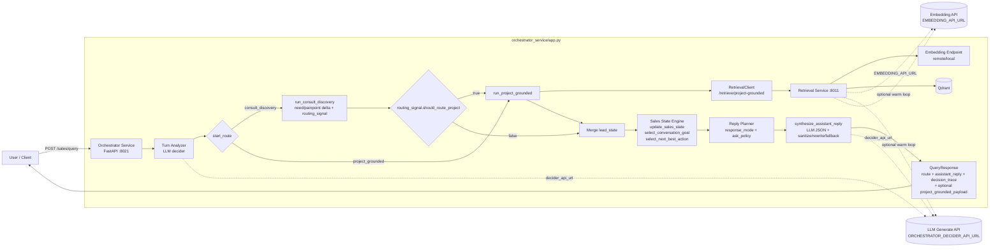
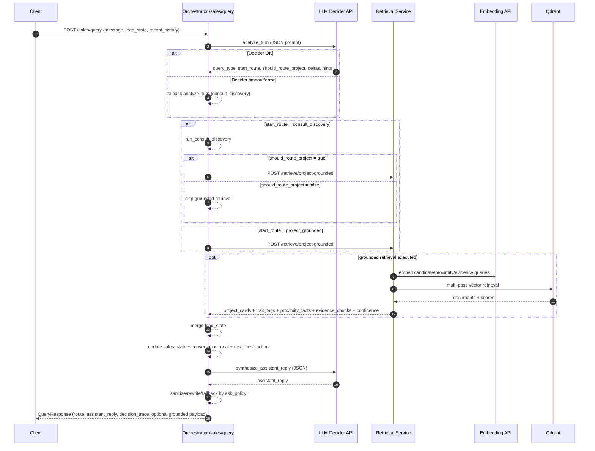

# So do Mermaid - Luong moi hien tai cua system agent

Tai lieu nay mo ta luong online hien tai theo code trong `orchestrator_service` + `retrieval_service`.

## 1) Kien truc tong the (component)

## 2) Sequence luong online /sales/query

## 3) Ket qua check runtime nhanh (thoi diem hien tai)

- `GET http://127.0.0.1:8021/health` -> `ok`
- `GET http://127.0.0.1:8011/health` (tu host) -> connection refused
- `POST /sales/query` test nhe bi timeout ~45s (giong timeout decider hien tai)

=> Luong code da dung theo kien truc tren; runtime hien tai dang co nghen/phu thuoc o dependency (decider/retrieval endpoint).
